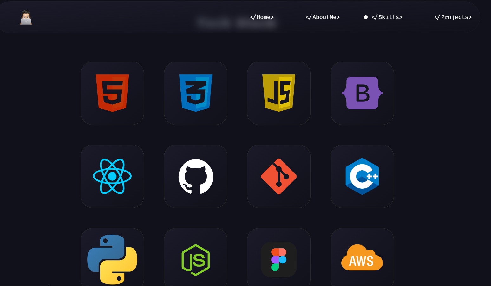

### Explore my projects, web presence, story, work experience, and contact details on this website.

# Sections 📚

✔️ Mini introduction\
✔️ About me \
✔️ Skills\
✔️ Projects\
✔️ Contact me

## Tools Used 🛠️

- [<b>GitHub</b>](https://github.com/) - For hosting the static website (HTML, CSS, JS).
- [<b>Animate on scroll library</b>](https://github.com/michalsnik/aos) - For animating the website while scrolling.
- [<b>Animista</b>](https://animista.net/) - For interactive animations.

Feel free to reach out to me at manikantanamo@gmail.com with any feedback for the website. :star: If you like it, star it!
